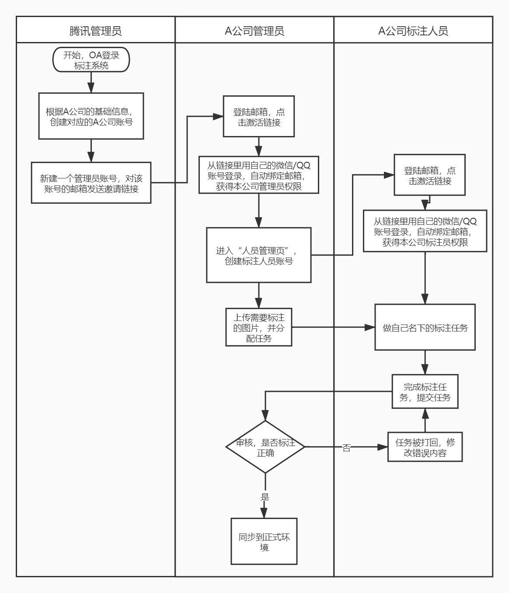
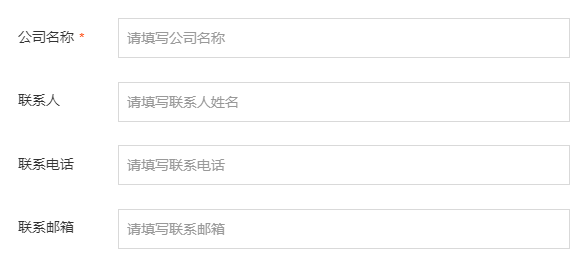
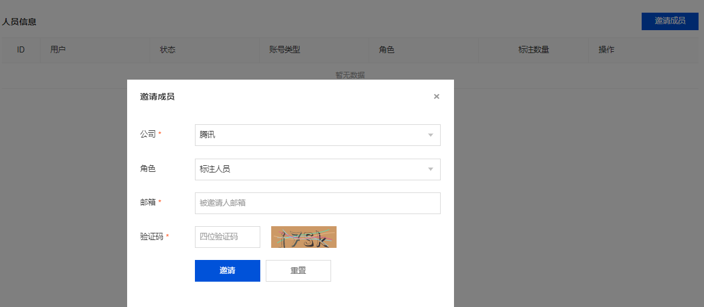
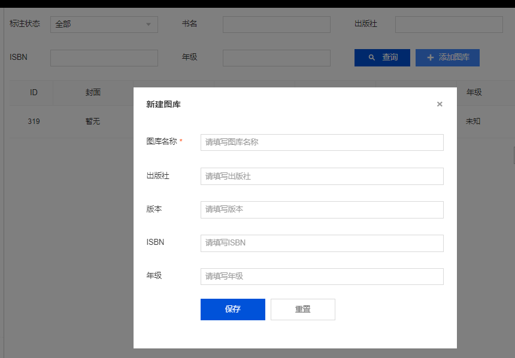
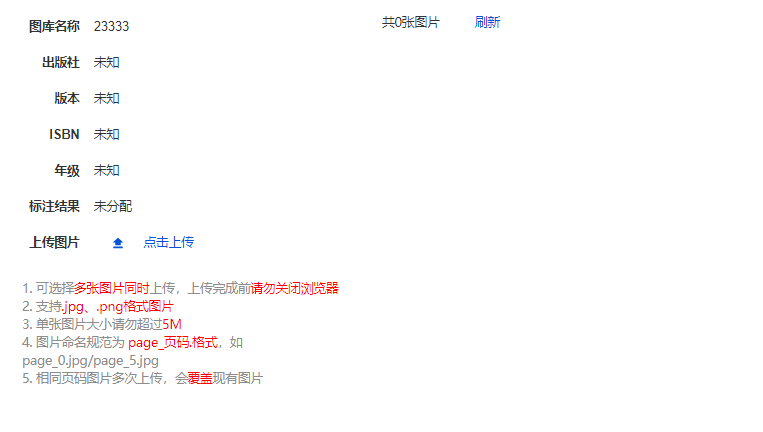
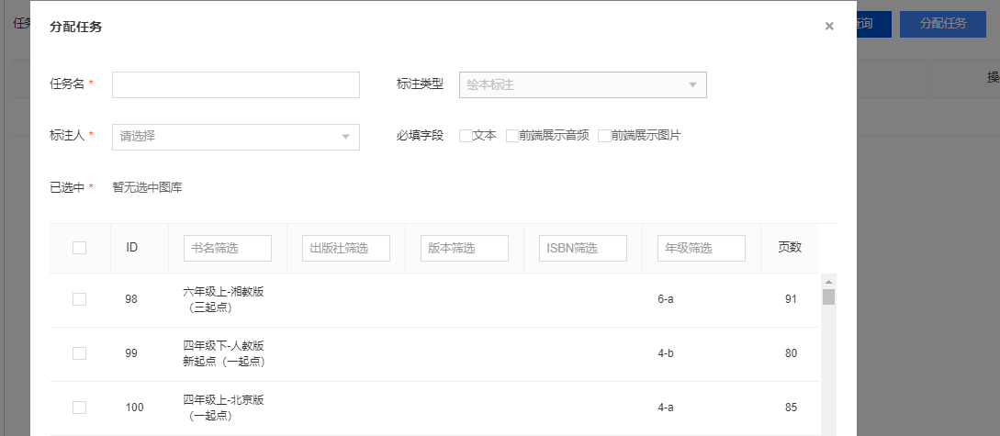
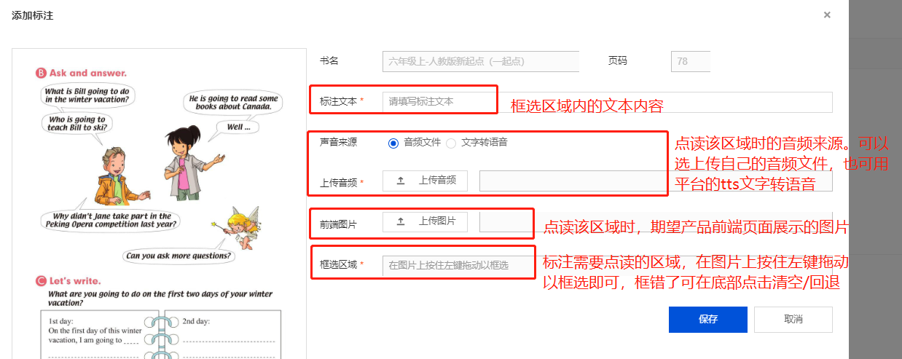
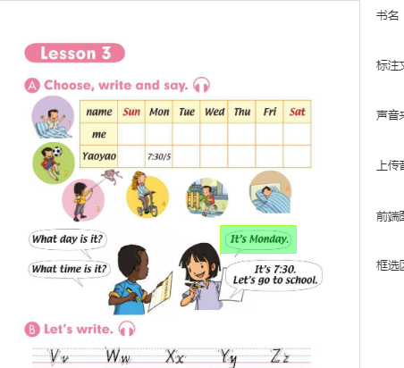

# 标注平台—使用指引
**标注平台两种标注模式-简介：**  
1，绘本阅读——应用场景是翻页即阅读，需要标注每一页对应的文本、音频、图片等内容。  
2，点读框选——应用场景是当用户用手指点击你标注框选的区域，就会自动读出对应句子/单词，也就是点到哪里读哪里，需要标注每一个框对应的文本、音频、图片等内容。  

**标注平台的使用流程如下：**  
  
PS：不兼容IE浏览器，仅兼容：chrome、safari、QQ/搜狗/360浏览器高速模式等现代浏览器  

# 一，  注册准备
## 1，申请使用权限
需要先申请在标注平台创建一个属于自己公司的公司账号，请准备好以下材料联系v_fpxie。
 

## 2，接受邀请，完成注册流程，成为管理员
注册流程开始后，请注意查收邮箱里的邀请邮件，按照邮件内容指引完成注册并激活账号成为管理员  

## 3，邀请自己公司内部成员完成注册流程
请到【公司管理】的【人员管理】，点击【邀请成员】开始邀请自己公司内部成员完成注册流程，并在此为每个人分配好平台权限。  

# 二，分配标注任务
## 1，上传待标注的书本图片
图库的概念是相当于一本书就是一个数据源， 我们可以从多个维度对它进行标注。
而上传图片有两种方式：  

1）开始上传需要标注的书本图片，在【图片标注】的【图库管理】里点击【添加图库】 ，按待标注图片的情况填写图片信息并保存。  
  

再点击【点击上传】，按规范上传图片即可  

  
 
2）有数据源，且数据的格式是规范且结构化的，需要有这些必备字段：图片/书名/页码，建议有这些字段：出版社/版本/ISBN/年级。如果采用这种方式请联系v_fpxie或czzou。  

## 2，分配任务到标注人员
将需要标注的图片上传好后，可以开始给标注人员分配任务了，先明确自己需要标注的是哪种类型，绘本阅读还是点读框选，再去对应的标注类型里点击【分配任务】将需要标注的图片分发给标注人员。  

  

# 三，开始标注-完成
## 1，按照预期开始标注
管理员将任务分配好后，标注人员登录标注平台发现自己名下已经有待标注的任务了，即可以按规范和预期进行标注了。  
  
 
**其中【点读框选】需要特别注意以下几点：**  
1、	这里标注【框选区域】时需覆盖到你期望的手指可能落的范围，不要只严格框着内容的区域，框大小的最低原则是在内容的基础上增加一个指尖的位置。  
2、	原则是两个不同目标的框选区域没有交集，然后根据业务自己的场景框定预期可以激活的区域即可。  

通常情况 **【点读框选】的大小** 如下图示：
   

## 2，标注完成，审核任务
标注完成后，标注人员提交该标注任务，审核人员即可开始进行审核；审核即查看是否按规范进行标注，可检查【标注文本】的内容是否正确，试听【声音来源】是否无误，确认【框选区域】的大小是否符合规范。  

审核不通过则打回重标  
审核通过，则点击通过并发布，该书的标注数据即同步至线上  

## 3，建立bot
请在【公司管理】的【BOT管理】里点击【新建bot】，创建属于你公司的bot（APP Key 填写在[腾讯云小微开放平台](https://dingdang.qq.com/doc/page/331)注册的应用 APP Key）。  

其中【OCR】设置控制中英文识别是否返回翻译结果。  

## 4，关联图库
请在【公司管理】的【BOT管理】里点击【修改】，勾选关联上所需关联的图库，至此才算完成标注并将标注的数据关联到对应的产品。

